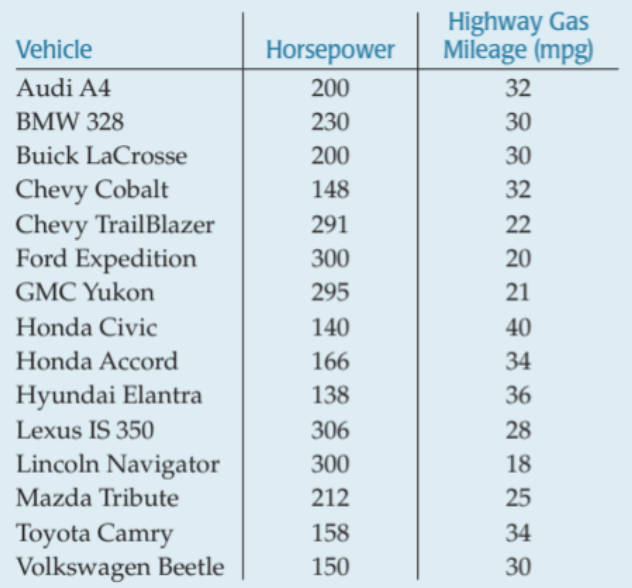
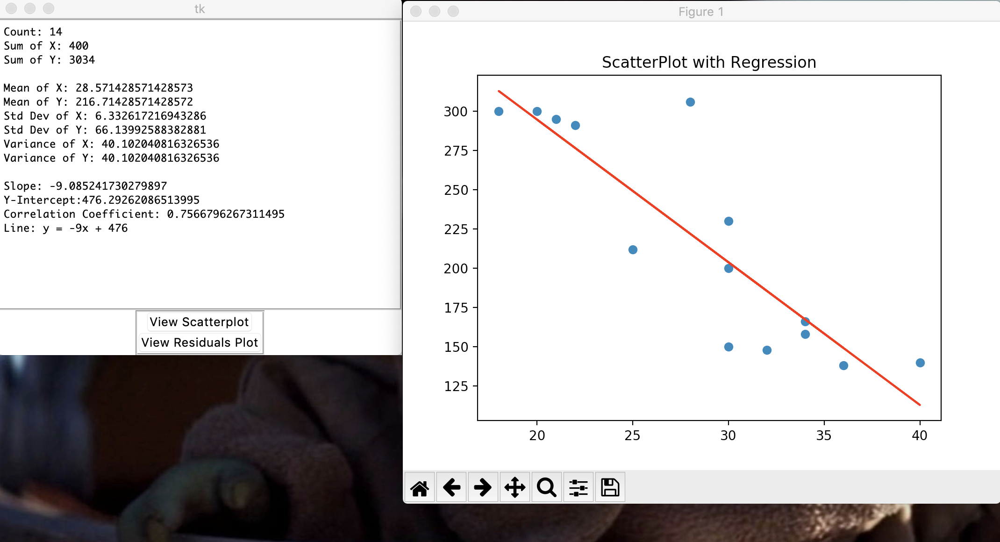

# Group-9 : PhotoGrapher
More info : https://devpost.com/software/photograph

 --> 

To run:
  1. Clone the repository or download it
  2. Open up terminal or command prompt 
  3. Go to your file or just drag the folder into terminal
  4. Have to run two scripts:
  
python3 imageToText.py --image [Add filepath of image here]
python3 StatsWindow.py
  
 
 ex. 
python3 imageToText.py --image Images/Horsepower_vs_mpg.png
python3 StatsWindow.py

      
      
 
  
 
